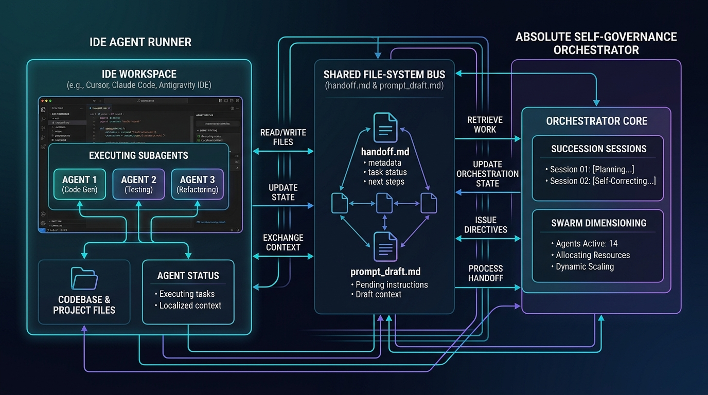

# Absolute Self-Governance in Multi-Agent Systems

This project implements the theoretical framework for **Absolute Self-Governance in Multi-Agent Systems**, a decentralized protocol that enables autonomous agent swarms to organize, dimension themselves, reach consensus on leadership/rosters, and transition between software development life cycle (SDLC) states without any human or centralized orchestrator intervention.

---

## Table of Contents

1. [Absolute Self-Governance Theory](#1-absolute-self-governance-theory)
2. [Mathematical Foundations](#2-mathematical-foundations)
    - [Information Theory & Shannon Entropy](#information-theory--shannon-entropy-context)
    - [Dynamic SDLC Dimensioning Model](#dynamic-sdlc-dimensioning-model)
    - [Thermal Escape & Threshold Decay (TETD) Consensus](#thermal-escape--threshold-decay-tetd-consensus)
3. [Architecture and State Machine](#3-architecture-and-state-machine)
    - [Continuous Nudger Watcher](#continuous-nudger-watcher)
    - [Transition Flow Lifecycle](#transition-flow-lifecycle)
4. [Project Structure](#4-project-structure)
5. [Installation & Verification](#5-installation--verification)
    - [Installation](#installation-instructions)
    - [CLI / Programmatic Execution](#cli--programmatic-execution)
    - [Running the Test Suite](#running-the-test-suite)
6. [IDE Agent Runner Integration](#6-ide-agent-runner-integration)


---

## 1. Absolute Self-Governance Theory

Traditional multi-agent systems rely on a centralized coordinator or orchestrator (e.g., a master agent, central dispatcher, or external runtime engine) to allocate tasks, assign roles, and handle failure recovery. While functional, this centralization introduces single points of failure, communication bottlenecks, and rigid scaling boundaries.

**Absolute Self-Governance** resolves these limitations by treating the agent swarm as a self-organized, decentralized system. Agents govern themselves through:
1. **Dynamic Scaling**: Scaling the size and roles of the swarm adaptively based on the complexity of the current software engineering task.
2. **Decentralized Consensus**: Voting on roster changes and phase handoffs using thermal algorithms that guarantee convergence.
3. **Event-Driven Coordination**: Triggering state transitions asynchronously based on filesystem signals, creating a continuous loop of development and self-organization.

By removing the centralized coordinator, the swarm can dynamically scale down to a single agent for simple tasks or scale up to hundreds of specialized agents for complex engineering pipelines.

---

## 2. Mathematical Foundations

The core protocol is governed by three mathematical frameworks that manage uncertainty, determine resource allocation, and ensure consensus convergence.

### Information Theory & Shannon Entropy Context

To determine the complexity of a given SDLC phase or feature requirement, we model the distribution of task requirements using Shannon Entropy. The information entropy $H(X)$ of a discrete random variable $X$ represents the average level of "information", "surprise", or "uncertainty" inherent in the system's possible outcomes:

$$H(X) = - \sum_{i=1}^{n} P(x_i) \log_2 P(x_i)$$

Where:
* $P(x_i)$ is the probability of occurrence of task type or feature category $x_i$.
* $H(X)$ quantifies the systemic complexity. Higher entropy implies higher task diversity and complexity, demanding a larger and more diversified swarm config.

### Dynamic SDLC Dimensioning Model

Given a set of feature requirements, the system must determine how many agents to allocate to each specialized role. The optimal subagent swarm config is computed using a linear transition model followed by rounding:

$$S_t = \text{round}(W \times R_t)$$

Where:
* $R_t \in \mathbb{R}^N$ is the **feature requirement vector** at time $t$, representing the complexity or scale of each of the $N$ input features.
* $W \in \mathbb{R}^{M \times N}$ is the **transition matrix** of shape $(M, N)$ mapping requirements to $M$ subagent roles.
* $S_t \in \mathbb{Z}^M$ is the resulting **swarm allocation vector**, representing the integer counts of subagents for each of the $M$ roles.

#### Dot-Product Count Formula
For each role $i$ (where $0 \le i < M$):

$$\text{Count}_i = \text{round}\left( \max\left(0.0, \sum_{j=1}^{N} W_{i,j} \times R_{j} \right) \right)$$

#### `LazyList` Implementation
To handle extremely large scaling workloads (e.g., $S_t$ elements in the millions) without causing Out-Of-Memory (OOM) errors, the package implements a memory-efficient `LazyList`. It stores cumulative role counts as **prefix sums** and performs a binary search (`bisect_right`) to instantiate individual `Agent` objects on-demand:

1. Let $C = [c_0, c_1, \dots, c_{M-1}]$ be the list of agent counts per role.
2. The prefix sums array $P$ is defined as: $P_k = \sum_{j=0}^{k} c_j$.
3. When querying index $idx$, binary search determines $role\_idx$ such that $P_{role\_idx - 1} \le idx < P_{role\_idx}$, instantiating `Agent(role=f"role_{role_idx}", ...)` dynamically.

---

### Thermal Escape & Threshold Decay (TETD) Consensus

When voting on a roster of successor agents, polarization or disagreement can lead to deadlock. The **Thermal Escape and Threshold Decay (TETD)** consensus algorithm mitigates deadlock by dynamically modifying the consensus environment over iterations.

Let:
* $k$ be the current iteration index.
* $B$ be the iteration buffer limit (the number of rounds allowed under standard target parameters before decay/scaling starts).
* $T_{\text{initial}}$ be the initial simulation temperature.
* $\tau_{\text{target}}$ be the target approval threshold.

#### Temperature Scale
If consensus is not reached within $B$ iterations ($k > B$), the system increases the simulation temperature $T_k$ by an increment rate $\gamma$:

$$T_k = T_{\text{initial}} + \gamma \times (k - B) \quad \text{for } k > B$$

Higher temperature introduces thermal noise (stochastic perturbations) to the individual agent votes, enabling them to escape local energy minima (polarized voting standoffs).

#### Threshold Decay
Simultaneously, the approval threshold $\tau_k$ decays by a decay rate $\delta$ per iteration to lower the barrier to agreement, clamped at a minimum required approval rate of 70% ($7.0$):

$$\tau_k = \max(7.0, \tau_{\text{target}} - \delta \times (k - B)) \quad \text{for } k > B$$

#### Iterative Score Allocation
During each iteration $k$, the simulated voting score for each agent is generated as follows:
* **For $k \le B$**:
  $$\text{Score} = 8.0 + \epsilon, \quad \epsilon \sim \text{Uniform}(-0.1, 0.1)$$
* **For $k > B$**:
  $$\text{Score} = 7.0 + \epsilon_{\text{base}} + \min(0.1, \text{Escape}), \quad \epsilon_{\text{base}} \sim \text{Uniform}(0.01, 0.09)$$
  $$\text{Escape} = | \eta \times T_k |, \quad \eta \sim \text{Uniform}(-0.01, 0.01)$$

The average score is evaluated. If the average score of all candidates matches or exceeds $\tau_k$, consensus is reached, and all candidates with individual scores $\ge \tau_k$ are approved. To guarantee termination, a safety cap breaks execution at $1000$ iterations.

---

## 3. Architecture and State Machine

The workflow is structured around an event-driven loop that reacts to task completions and automates the self-governance lifecycle.

### Continuous Nudger Watcher

The `ContinuousNudger` is an asynchronous file watcher that runs in the background. It continuously monitors the workspace directory for the presence of `handoff.md`.

* **Trigger Condition**: When `handoff.md` is detected, it is parsed as a YAML document. If the document has the field `status: COMPLETED` and contains a list of candidate agent IDs, the succession sequence is immediately triggered.
* **Fault Tolerance**: The watcher handles malformed YAML, temporary filesystem access locks (`PermissionError`), and empty files gracefully, continuing to watch the directory without crashing.

### Transition Flow Lifecycle

The self-governance state machine transitions through the following pipeline:

```
[Watcher Loop] 
      │
      ▼  (Detects status: COMPLETED in handoff.md)
┌──────────────────────┐
│  Succession Session  │  ──► Reads YAML, extracts candidate agents
└──────────────────────┘
      │
      ▼
┌──────────────────────┐
│    TETD Consensus    │  ──► Simulates iterative votes on roster candidates;
└──────────────────────┘      adjusts T and tau dynamically if k > B
      │
      ▼
┌──────────────────────┐
│   Dimension Swarm    │  ──► Uses approved roster size to build requirements:
└──────────────────────┘      R_t = [len(approved_roster), 1.0] -> S_t = round(W * R_t)
      │
      ├─────────────────────────────────────────┐
      ▼ (Append log entry)                      ▼ (Write YAML config)
┌───────────────────────────┐             ┌─────────────────────────┐
│  roster_rotation_log.md   │             │     prompt_draft.md     │
│  - Commit log of approved │             │  - Nested Swarm JSON    │
│    roster names           │             │  - Next-phase instructions│
└───────────────────────────┘             └─────────────────────────┘
```

1. **Detection**: `ContinuousNudger` catches `status: COMPLETED` and initiates succession.
2. **Roster Consensus**: `run_consensus()` resolves the active list of approved agents using TETD.
3. **Dimensioning**: `dimension_swarm()` calculates how many agents of each role are needed based on the approved roster size.
4. **Log Rotation**: Rotation metadata is logged to `roster_rotation_log.md`.
5. **Prompt Drafting**: A JSON configuration matching the Appendix D schema is nested and written into `prompt_draft.md` along with instructions to guide the new swarm.

---

## 4. Project Structure

```
magical-meitner/
├── src/
│   └── self_governance/
│       ├── __init__.py      # Package entry point
│       ├── consensus.py     # TETD consensus simulation
│       ├── dimensioning.py   # SDLC Dimensioning & LazyList
│       ├── models.py        # Appendix D JSON structures (Agent, SwarmConfig)
│       └── nudger.py        # ContinuousNudger state machine
├── tests/
│   ├── test_consensus.py    # Unit tests for TETD consensus
│   ├── test_dimensioning.py # Unit tests for SDLC Dimensioning
│   ├── test_nudger.py       # Unit tests for ContinuousNudger
│   ├── test_stress.py       # Load & concurrency tests
│   └── test_e2e.py          # End-to-end integration tests (Tiers 1-4)
├── pyproject.toml           # Standard Python package metadata
├── uv.lock                  # Lockfile for dependency management
└── README.md                # This documentation file
```

---

## 5. Installation & Verification

### Installation Instructions

This project requires **Python 3.13+**. You can install the package locally using `pip` or `uv`.

#### Standard Installation
To install the package in your current environment:
```bash
pip install .
```

#### Editable/Development Mode
To install the package in editable mode so changes to the source code are reflected immediately:
```bash
pip install -e .
```

#### Using `uv` (Recommended)
If you have `uv` installed, you can sync the lockfile and install in editable mode:
```bash
uv pip install -e .
```

---

### CLI / Programmatic Execution

Since the package functions as a decentralized runtime library, you can spin up the event watcher or invoke the mathematical modules programmatically or via Python CLI one-liners.

#### 1. Start the Continuous Nudger Watcher
To run the event-driven watcher on a specific directory:
```bash
python3 -c "from self_governance.nudger import ContinuousNudger; ContinuousNudger('/path/to/workdir').watch_handoff()"
```
Alternatively, using `uv`:
```bash
uv run python3 -c "from self_governance.nudger import ContinuousNudger; ContinuousNudger('.').watch_handoff()"
```

#### 2. Run TETD Consensus Programmatically
To simulate consensus voting on a set of candidates:
```python
from self_governance.consensus import run_consensus

result = run_consensus(
    initial_roster=["agent_alpha", "agent_beta", "agent_gamma"],
    B=3,
    target_tau=9.0,
    initial_temp=1.0,
    gamma=0.1,
    delta=0.5
)

print(f"Approved Roster: {result.approved_roster}")
print(f"Final Temp: {result.final_temperature}")
print(f"Final Threshold: {result.final_threshold}")
```

#### 3. Run SDLC Dimensioning Programmatically
To compute a swarm configuration:
```python
from self_governance.dimensioning import dimension_swarm

requirement_vector = [2.0, 3.0]
transition_matrix = [
    [1.0, 0.5],  # role_0 mapping
    [0.0, 1.0]   # role_1 mapping
]

swarm_config = dimension_swarm(requirement_vector, transition_matrix)

# Print serialized Appendix D JSON
import json
print(json.dumps(swarm_config.dict(), indent=2))
```

---

### Running the Test Suite

The test suite validates correctness across four testing tiers (Feature Coverage, Boundary/Corner Cases, Cross-Feature Combinations, and Real-World Workloads) with **74 total test cases**.

#### Run all tests using `pytest`
```bash
pytest
```

#### Run all tests using `uv` (Recommended)
```bash
uv run pytest
```

#### Run specific test modules
* To test only the consensus module:
  ```bash
  pytest tests/test_consensus.py
  ```
* To test only the end-to-end integration:
  ```bash
  pytest tests/test_e2e.py
  ```
* To run the stress/concurrency tests:
  ```bash
  pytest tests/test_stress.py
  ```

---

## 6. IDE Agent Runner Integration

The Absolute Self-Governance Orchestrator integrates seamlessly with external IDE Agent Runners (such as Claude Code, Cursor, or the Antigravity IDE) via a decoupled file-system bus. This allows agents executing tasks in your IDE to scale, vote, and transition state automatically.

### Integration Architecture Diagram



### Steps to Use

Follow these steps to coordinate an autonomous development swarm in your workspace:

#### Step 1: Initialize the Watcher
Start the orchestrator background process to monitor your project workspace directory (replace `.` with the path to your workspace if different):
```bash
uv run self-governance run-nudger --dir .
```
This spawns a thread-safe `watchdog` monitoring loop tracking `handoff.md`.

#### Step 2: Set the Initial Agent Roster
Create a file named `handoff.md` in the directory root containing your starting workspace metadata and target tasks:
```yaml
status: COMPLETED
candidates:
  - agent_code_gen
  - agent_unit_testing
  - agent_refactoring
```
As soon as you save this file, the `watchdog` event triggers the Succession Voting session.

#### Step 3: Run Succession Voting
The orchestrator simulates a democratic consensus council across the candidate agent list using the TETD algorithm. 
- You will see logs detailing the consensus rounds, temperature modifications, and threshold decays.
- Once consensus is achieved, the approved roster details are automatically committed to `roster_rotation_log.md`.

#### Step 4: Retrieve Swarm Prompt Context
The orchestrator writes the finalized swarm configuration in standard nested JSON format to `prompt_draft.md`:
```yaml
--- Swarm Configuration ---
{
  "swarm": [
    {"role": "role_0", "prompt": "Prompt for role_0"},
    {"role": "role_1", "prompt": "Prompt for role_1"}
  ]
}
--- End Configuration ---
Prompt: Guide the swarm to collaborate on the next phase.
```

Your IDE agent runner (Cursor, Claude Code, etc.) reads this newly generated prompt configuration to spin up the next set of specialized worker subagents, executing the next SDLC cycle autonomously.

