# System Architecture Attention Graph

This graph visualizes the interactions and dependencies between the core modules of the Absolute Self-Governance system.
Control flow edges are represented by solid lines (`-->`), while data dependencies are represented by dashed lines (`-.->`).

```mermaid
graph TD
    %% Nodes representing standard Python modules
    cli_py["cli.py"]
    nudger_py["nudger.py"]
    consensus_py["consensus.py"]
    learning_py["learning.py"]
    p2p_py["p2p.py"]
    economics_py["economics.py"]
    models_py["models.py"]
    gemini_adapter_py["gemini_adapter.py"]
    db_py["db.py"]
    auth_py["auth.py"]
    billing_py["billing.py"]
    complexity_py["complexity.py"]
    anti_drift_py["anti_drift.py"]
    graph_memory_py["graph_memory.py"]
    devserver_py["devserver.py"]
    security_py["security.py"]

    %% External Data/Disk dependencies
    db_file[("self_governance.db (SQLite)")]
    handoff_file[["handoff.md (Disk)"]]
    interrupt_file[["interrupt.md (Disk)"]]
    monitoring_events[["monitoring_events.ndjson"]]
    roster_rotation[["roster_rotation_log.md"]]
    pipeline_artifact[["pipeline_artifact.jsonl"]]
    prompt_draft[["prompt_draft.md"]]
    learning_state[[".learning_state.json"]]
    hnsw_index[["HNSW Index Files"]]

    %% Control Flow Edges (solid, Arrow)
    cli_py -->|"watch_handoff() / trigger_succession()"| nudger_py
    cli_py -->|"run dev server"| devserver_py
    cli_py -->|"run_security_audit()"| security_py
    cli_py -->|"format_retro_report()"| learning_py
    cli_py -->|"session-save / session-restore"| db_py
    nudger_py -->|"process_handoff() (callback)"| nudger_py
    nudger_py -->|"run_security_audit()"| security_py
    nudger_py -->|"calculate_ast_complexity()"| complexity_py
    nudger_py -->|"run_consensus()"| consensus_py
    nudger_py -->|"self_critique() / loop detection"| anti_drift_py
    nudger_py -->|"distill_session() / restore_session_context()"| learning_py
    nudger_py -->|"add_session_node()"| graph_memory_py
    consensus_py -->|"_call_gemini_and_track()"| gemini_adapter_py
    consensus_py -->|"PersonaQualityGate.passes()"| models_py
    gemini_adapter_py -->|"calculate_cost()"| billing_py
    gemini_adapter_py -->|"charge() / route_model()"| economics_py
    devserver_py -->|"get_learning_state()"| learning_py
    devserver_py -->|"create_share_token() / gossip"| p2p_py
    devserver_py -->|"authenticate / rate limit check"| auth_py

    %% Data Dependency Edges (dashed, Arrow)
    cli_py -.->|"writes live constraints"| interrupt_file
    nudger_py -.->|"reads / deletes constraints"| interrupt_file
    nudger_py -.->|"reads candidate scopes"| handoff_file
    nudger_py -.->|"writes status trace logs"| monitoring_events
    nudger_py -.->|"writes succession completions"| roster_rotation
    nudger_py -.->|"reads/writes prior context"| pipeline_artifact
    nudger_py -.->|"writes SwarmConfigs"| prompt_draft
    learning_py -.->|"reads/writes averages"| learning_state
    learning_py -.->|"reads/writes vector db"| hnsw_index
    db_py -.->|"reads/writes state"| db_file
    auth_py -.->|"queries/updates tenants & rate limits"| db_py
    billing_py -.->|"writes token costs"| db_py
    graph_memory_py -.->|"appends session nodes & edges"| db_py
    devserver_py -.->|"reads token usage & statistics"| db_py

    %% Legend Subgraph
    subgraph Legend
        direction LR
        cf_node["Module A"] -->|"Control Flow (solid)"| cf_node_target["Module B"]
        dd_node["Module A"] -.->|"Data Dependency (dashed)"| dd_node_target["Module B"]
    end
```

